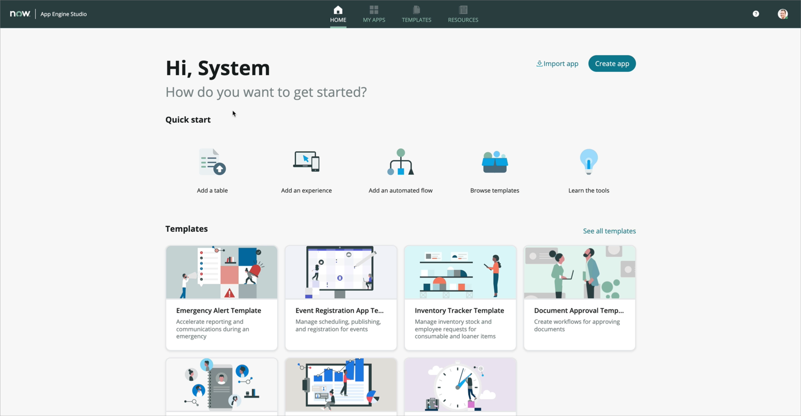
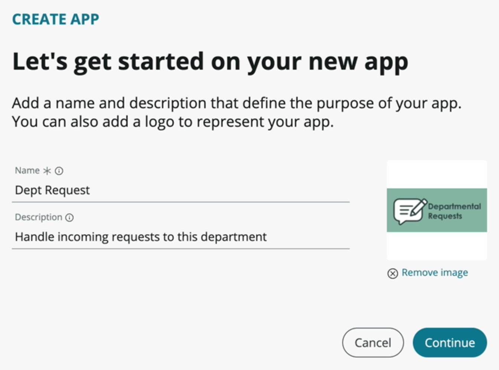
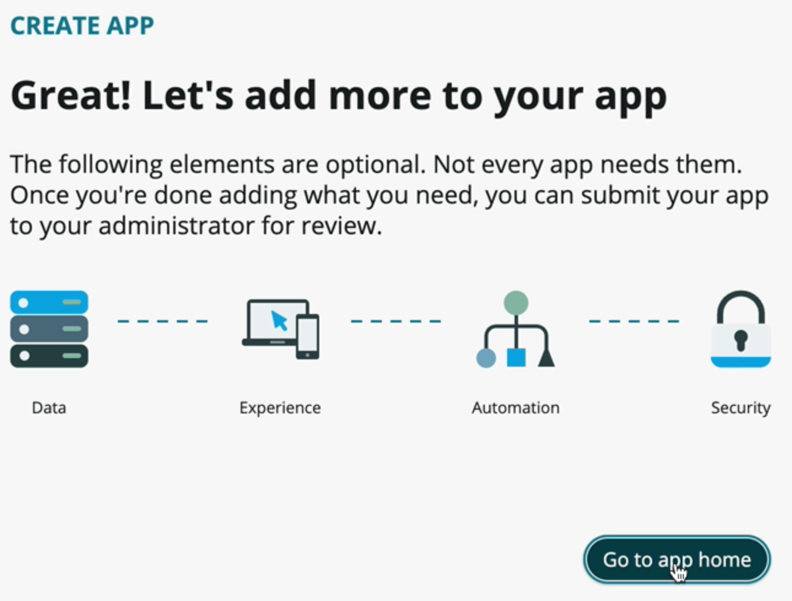

## Exercise 1 - Create the App

In this exercise, you will launch App Engine Studio and create an application.

### Demo Video

Click the thumbnail below to launch a YouTube video of someone working through this exercise.

### Launch App Engine Studio

1. Log in to your Personal Developer Instance (PDI) as the admin user. If you do not have a PDI, open the [ServiceNow Developer Site](https://developer.servicenow.com/) to obtain a Rome PDI.

1. Use the Application Navigator to open **App Engine > App Engine Studio**.

    

    

### Create an App

1. Click the **Create app** button toward the top right of the screen to create a new app.

1. Configure the Create App screen.

    * _Name_: **Dept Request**
    * _Description_: **Handle incoming requests to this department**
    * _App logo_: [This file](assets/deptreqicon.png)

    

1. Click **Continue**.

1. Once the app is created, click **Go to app home**.

    

[Proceed to Exercise 2 - Create a Data Model](Exercise2-DataModel.md)