## Exercise 3 - Create the Experiences

In this exercise, you will create a workspace and catalog experience for the application.

### Demo Video

Click the thumbnail below to launch a YouTube video of someone working through this exercise. 

<!---->

<iframe id="video" width="560" height="315" src="https://www.youtube.com/embed/1_qtlNEraj8/" frameborder="0" allow="autoplay; encrypted-media" allowfullscreen=""></iframe>

### Create a Workspace Experience

A workspace gives your fulfillers and approvers a way to interact with your application.

1. Go back to your App Home screen.

1. Click **+Add** next to experience.

    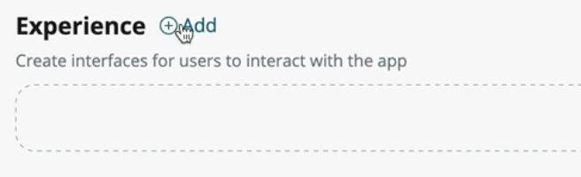

1. Choose **Workspace**.

    

1. Click **Begin** in the modal that comes up.

1. Leave the form the way it is and click **Continue**.

1. The data screen should have the following values:

    * _Primary Table_: **Request**
    * _Secondary Tables_: **Type**

    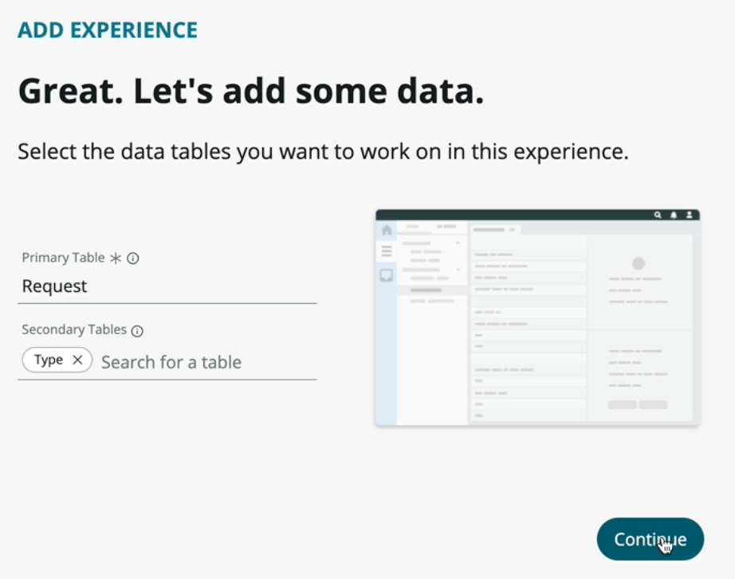

1. Click **Done**.

### Create a Catalog Item

A catalog item will allow your requesters to open a request from your portal via an easy-to-use form.

1. Click **+Add** next to experience.

1. Choose **Catalog item**.

1. Click **Begin** in the modal that comes up to open Catalog Builder.

1. In the form that comes up enter:

    * _Name_: **Departmental Request**
    * _Description_: **Submit a departmental request**

    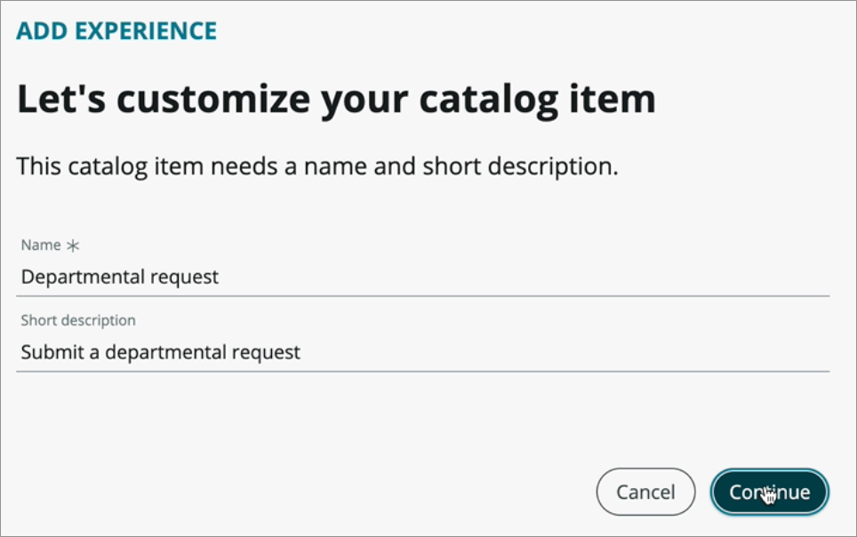

1. Choose **Edit catalog item**.

1. The name and description should be shown on this screen. In the item details section, enter this _Description_:

    **Fill out the type of request and details about the request. Upon approval and fulfillment, you will receive an email.**

1. Click **Continue to Destination** at the bottom right.

    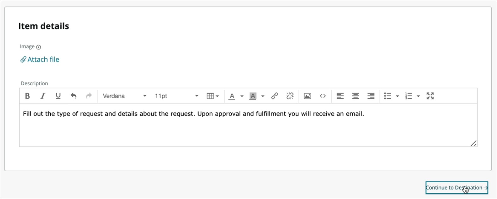

1. Enter your request table as the _Record submission table_.

    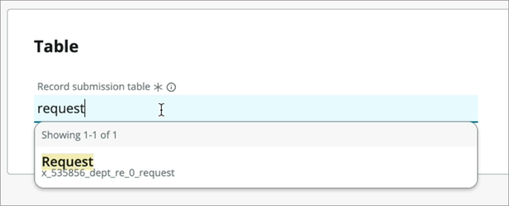

1. Click **Continue to Location**.

1. Now you will choose where this catalog item will live. Click **Browse** under _Catalogs_.

1. Choose the **Service Catalog** and use the \> to move it to the right bucket.

    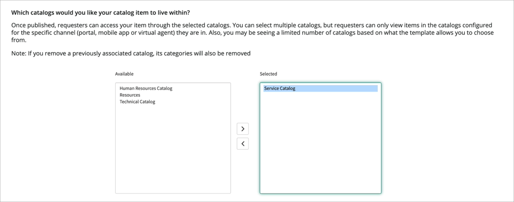

1. Click **Save selections**.

1. Click **Browse** under _Categories_.

1. Choose the **Can we help you?** and use the \> to move it to the right bucket.

    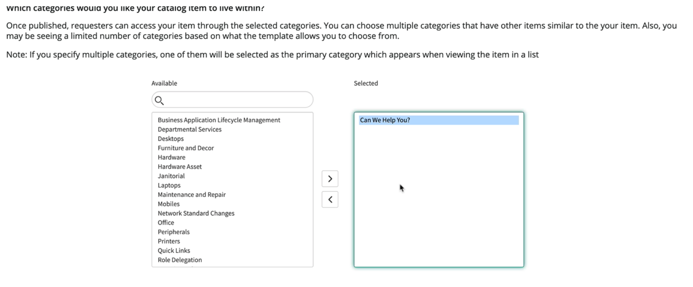

1. Click **Save selections**.

1. Click **Continue to Questions**.

1. Choose **Insert new question**.

    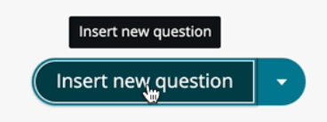

1. Fill out the question form as follows:

    * _Question type_: **Choice**
    * _Question subtype_: **Record reference**

    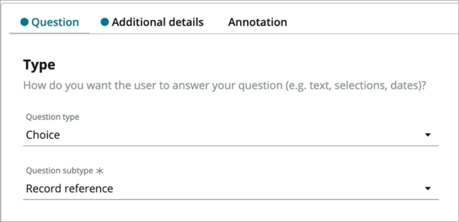

    * _Map to a specific field on the table_: **true** (checked)
    * _Table field_: **Type**
    * _Question label_: **Choose the type of request**
    * _Mandatory_: **true**

    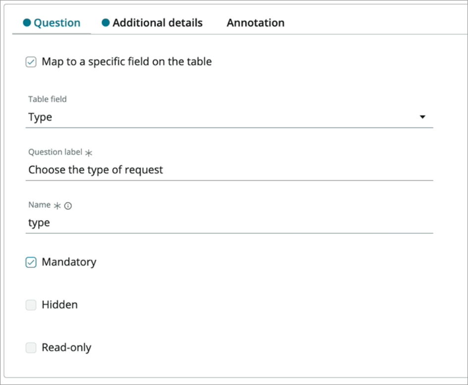

1. Click **Continue to Additional details**.

1. Set the _Source table_ to your **Type** table.

    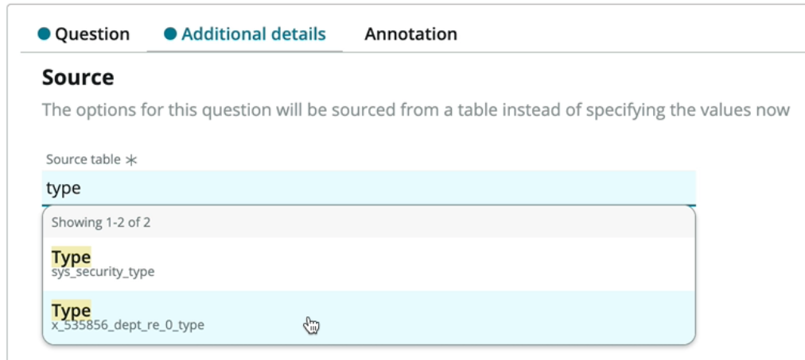

1. Click the **Insert Question** button at the bottom right of your screen under _Question Preview_.

    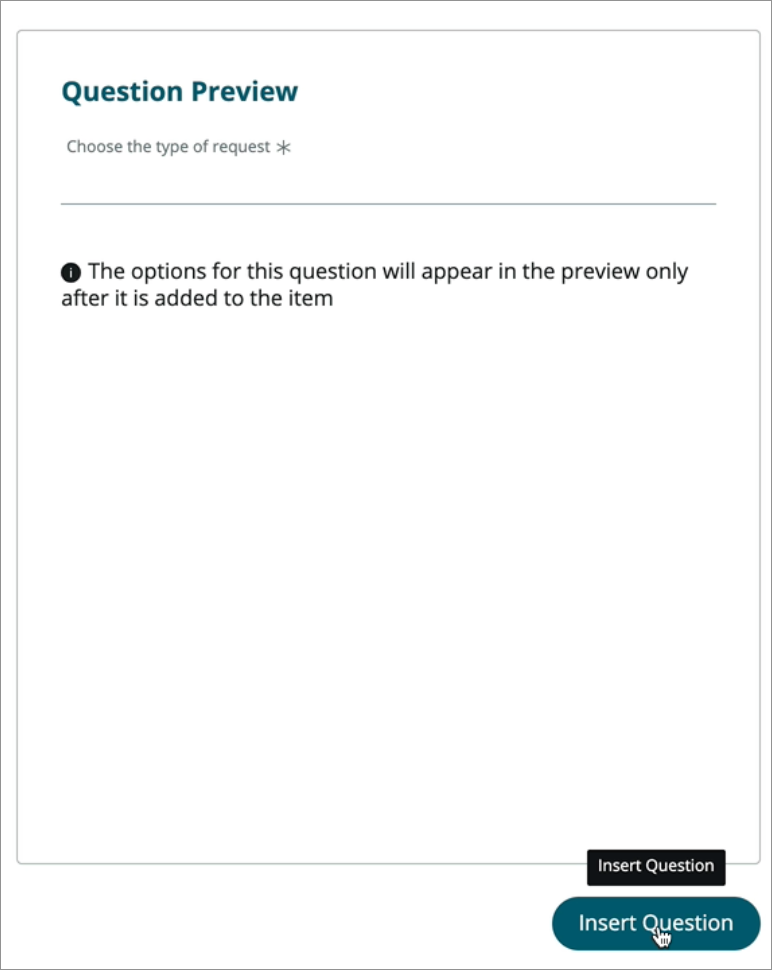

1. Click the **Insert new question** button to insert another question.

1. Fill out the question form as follows:

    * _Question type_: **Text**
    * _Question subtype_: **Multi-line**

    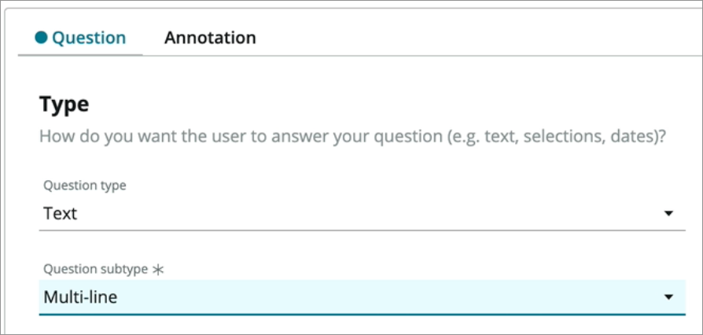

    * _Map to a specific field on the table_: **true** (checked)
    * _Table field_: **Description**
    * _Question label_: **Describe your request in as much detail as possible**
    * _Mandatory_: **true**

    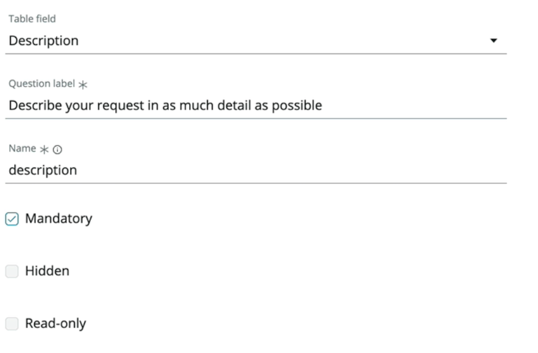

1. Click the **Insert Question** button at the bottom right of your screen under _Question Preview_.

1. Click **Continue to Settings**.

1. Click **Continue to Access**.

1. Click **Continue to Review and Submit**.

1. This shows you a full view of everything you've filled out. Click the **Submit** button at the top of this form to make this catalog item available in the Service Catalog.

    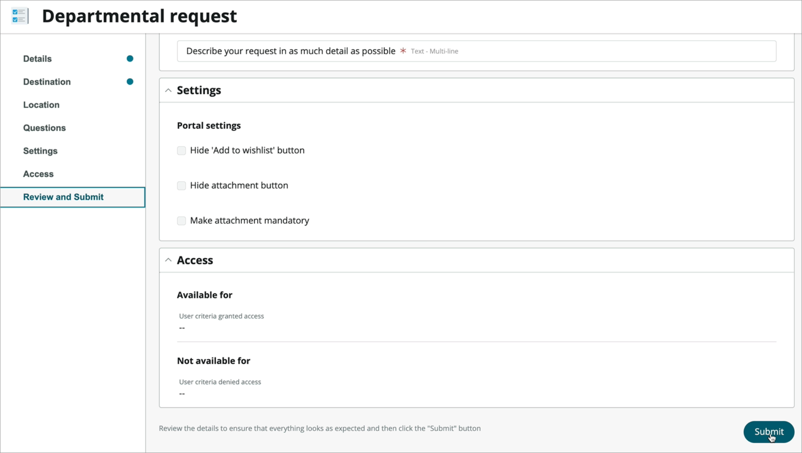

1. Click **Return to my application**.

[Proceed to Exercise 4 - Add automation](Exercise4-Automation.md)