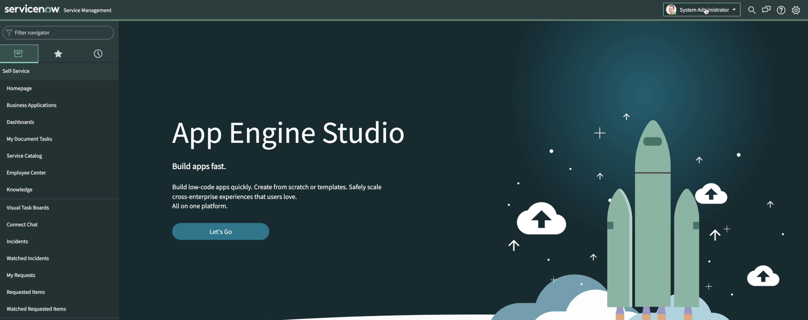
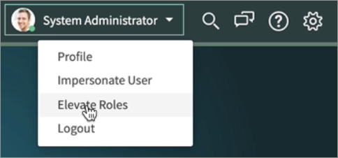
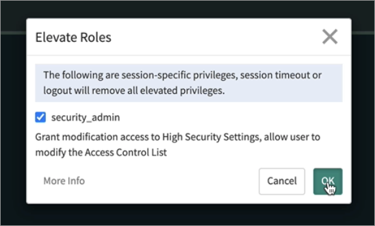
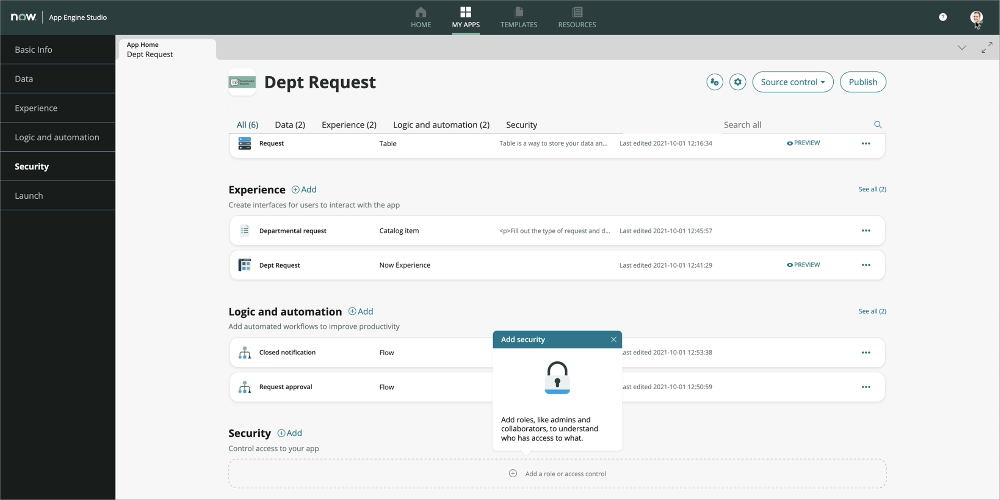
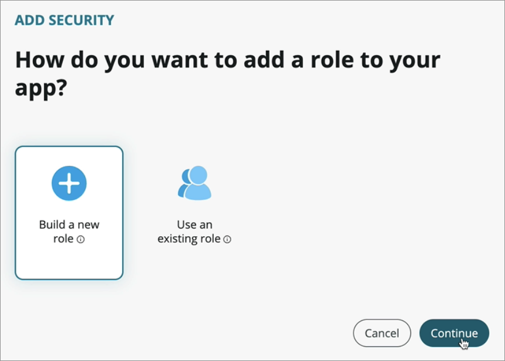
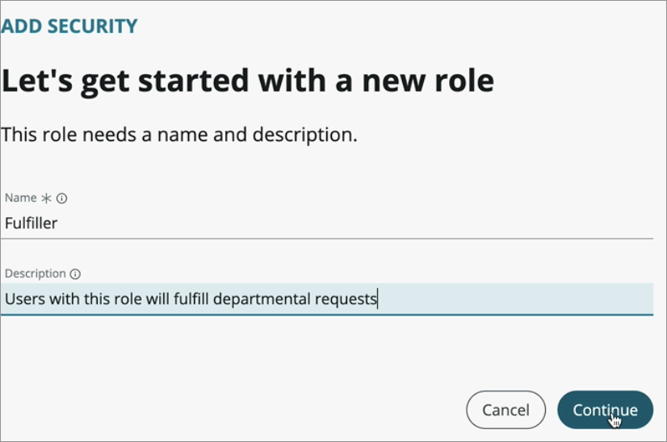
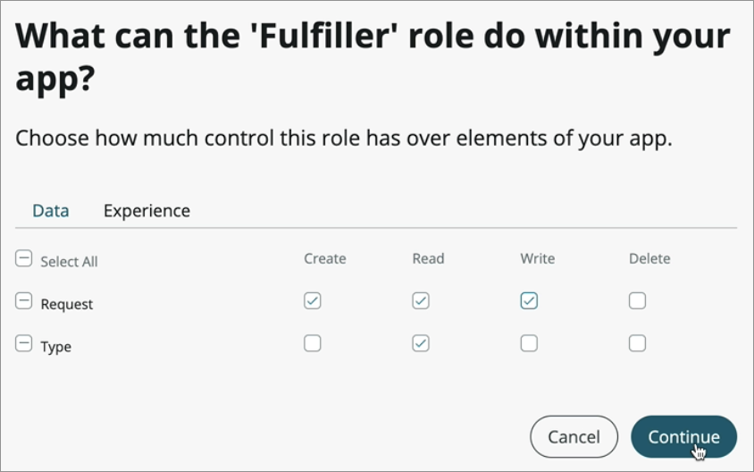

## Exercise 5 - Security

In this exercise, you will create roles and add security to your tables.

### Demo Video

Click the thumbnail below to launch a YouTube video of someone working through this exercise. 

<!---->

<iframe id="video" width="560" height="315" src="https://www.youtube.com/embed/inR4UIuVjBA/" frameborder="0" allow="autoplay; encrypted-media" allowfullscreen=""></iframe>

### Elevate your privelges

1. Switch back to the platform view of your instance, which was the view with the left hand navigation you had when you first logged in. If you've closed that tab, open another tab with url: https://devXXXXXXX.service-now.com (replace XXXXXX with your instance number).

    

1. Click **System Administrator** at the top left and choose **Elevate Roles** from the dropdown.

    

1. Click the _security_admin_ checkbox and choose **OK**.

    

### Add Security

1. Click back to your app engine studio tab and refresh _App Home_ page. The security section should now be clickable.

    

1. Click the **+Add** button in the Security section.

    

1. In the screen that comes up choose **Build a new role** then click **Continue**.

    

1. Configure the new role screen.

    * _Name_: **Fulfiller**
    * _Description_: **Users with this role will fulfill departmental requests**

    

1. Click **Continue**.

1. In the screen that comes up give the Fulfiller role Create, Read, and Write access to the Request table and Read access to the Type table.

    

1. Click the **Experience** tab and give the fulfiller role access to the Dept Request experience.

1. Click **Continue**.

1. Click **Done** on the screen that comes up.

1. Repeat the previous steps to add a role called _Admin_ that has full access to all tables and experiences.

[Proceed to Exercise 6 - Test your app](Exercise6-TestApp.md)