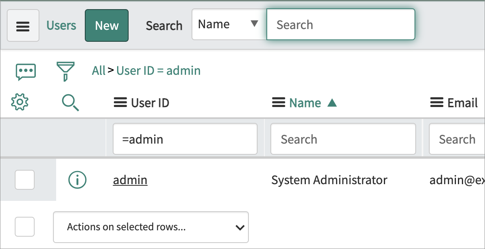
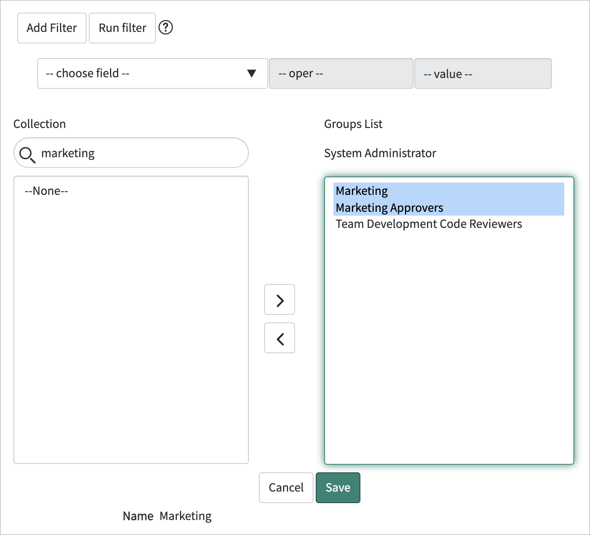
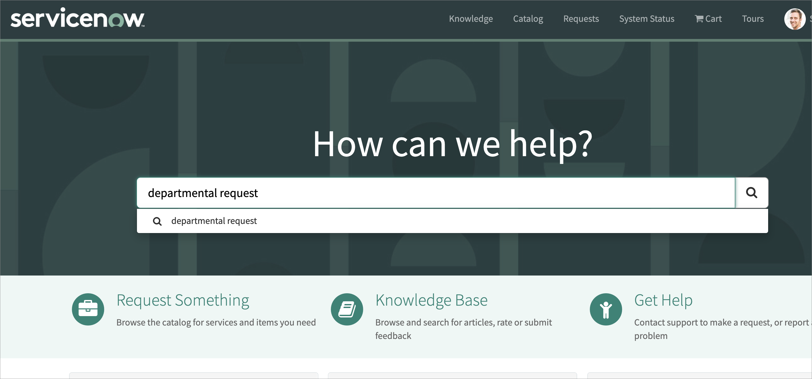
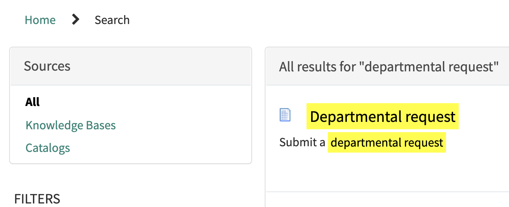
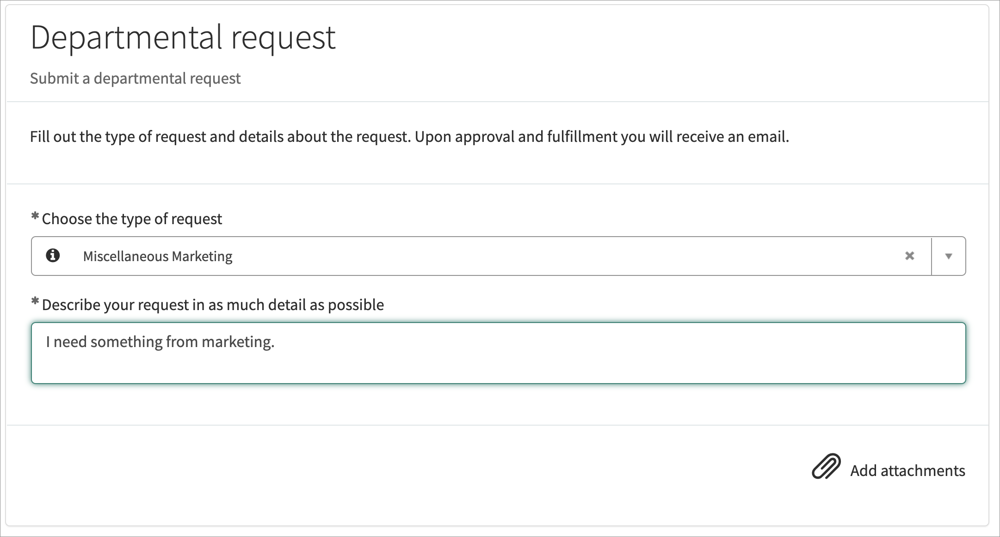
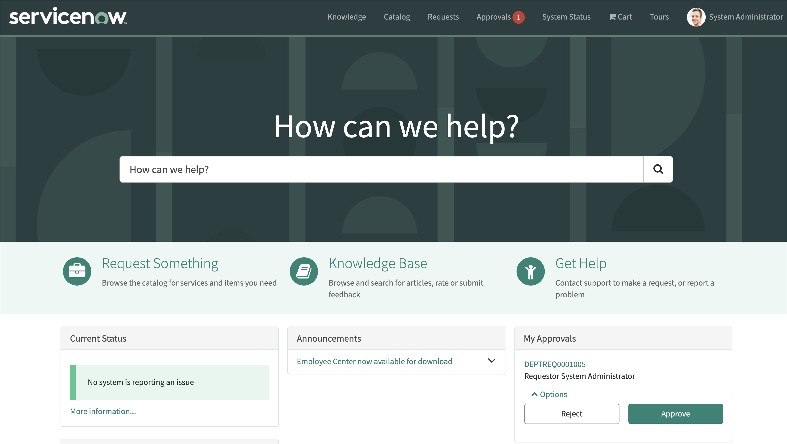
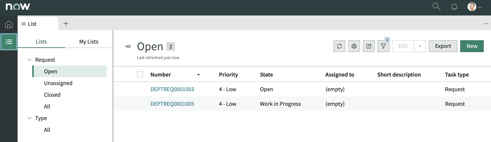
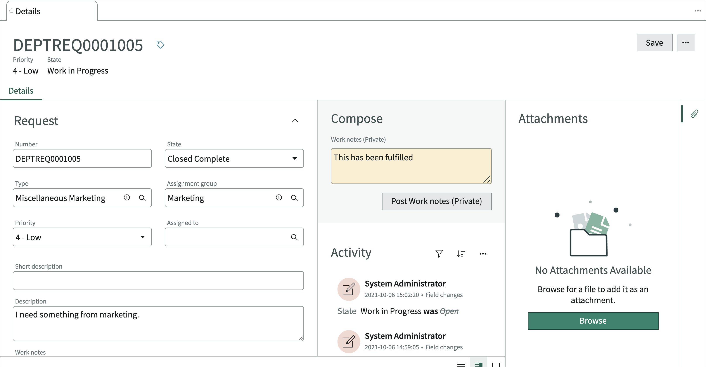
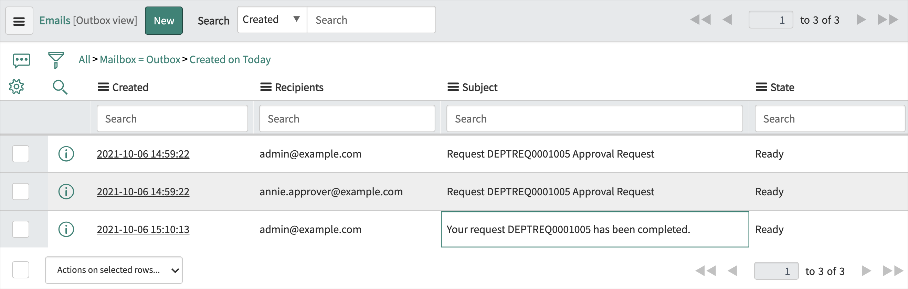

## Exercise 6 - Test your app

For this exercise, you're going to test the app as an admin user to reduce the amount of role and group administration.

### Demo Video

Click the thumbnail below to launch a YouTube video of someone working through this exercise. 

<!---->

<iframe id="video" width="560" height="315" src="https://www.youtube.com/embed/pWRwI_EO5hM/" frameborder="0" allow="autoplay; encrypted-media" allowfullscreen=""></iframe>

### Set up your test data

You'll need to add the admin user to the _Marketing_ and _Marketing Approval_ groups.

1. In the platform view, go to User Administration and click **Users**.

    

1. Find the _admin_ user in the list and click on in.

    

1. In the _Groups_ related list at the bottom of the form click **Edit**.

    

1. Move the _Marketing_ and _Marketing Approval_ groups from the left side of the slushbucket to the right and click **Save**.

    

### Testing - Submit a request

In this section you will submit a request from the service portal like any employee in your company would be able to do.

1. Navigate to your service portal by going to https://devXXXXXX.service-now.com/sp.

1. Search _departmental request_ under _How can we help?_.

    

1. Click the _Departmental Request_ catalog item when the search results come up.

    

1. In the form that comes up choose **Miscellaneous Marketing** as the request type and add a description.

    

1. Click **Submit** on the right.

1. Make a note of the request number that comes up.

### Testing -- Approve the request

Generally, approvals happen through email or mobile, but they can also happen through the portal.

1. Click **Home** in the breadcrumbs or the ServiceNow logo on the service portal to get back to the homepage. 

1. You should see the My Approvals section on the bottom right of the portal. Click **Approve**.

    

### Testing - Fulfill the request

1. Go back to the _App Home_ in your _App Engine Studio_ tab.

1. In your _Dept Request_ app, choose **PREVIEW** in the _Now Experience_ line under the _Experience_ section to open the workspace you created earlier.

    

1. In the new workspace tab that comes up, click the list icon in the left bar .

1. On the screen that comes up choose the record that was just created and approved. It should be in the _Work in Progress_ state.

    

1. In the form that comes up, add a work note and change the state to Closed Complete.

    

1. Click **Save** at the top right of the form.

### Testing - Closed email

1. Go back to the platform view of your instance with the left navigator and choose System Mailboxes > Outbound > Outbox.

1. Validate that you can see the record with the subject line _Your request DEPTREQXXXXXXX has been completed_.

    

## What Now?

To learn more about building applications using ServiceNow visit the [Developer Site](https://developer.servicenow.com/)